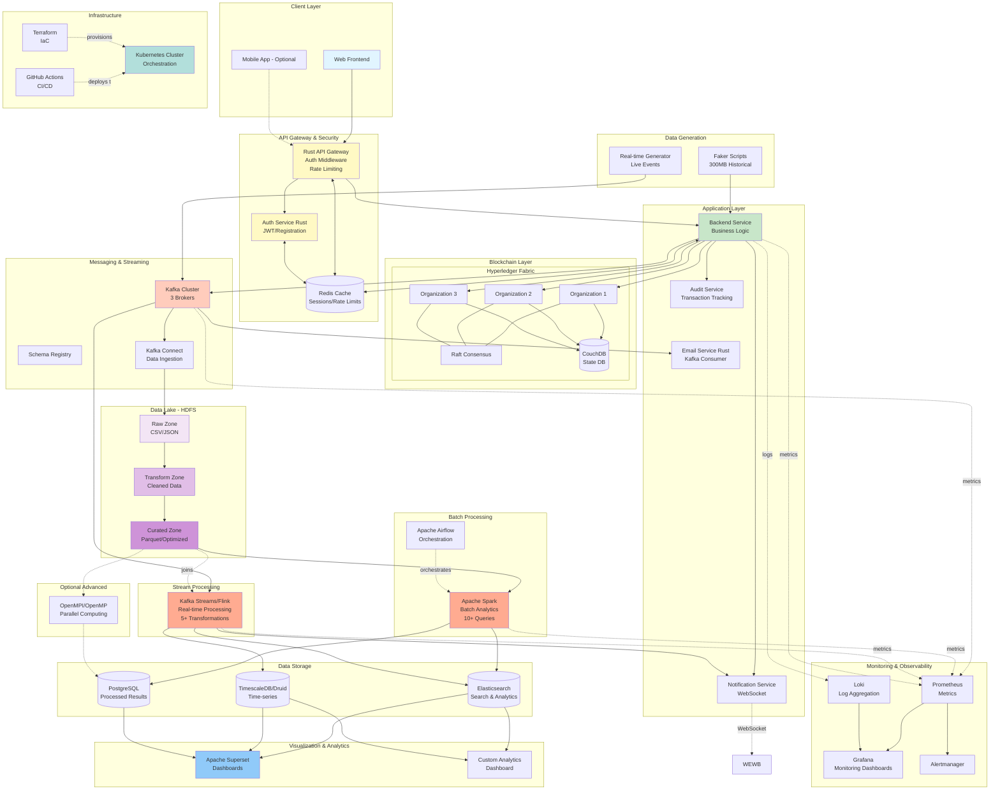

```mermaid
graph TB
subgraph "Client Layer"
WEB[Web Frontend]
MOBILE[Mobile App - Optional]
end

    subgraph "API Gateway & Security"
        GATEWAY[Rust API Gateway<br/>Auth Middleware<br/>Rate Limiting]
        AUTH[Auth Service Rust<br/>JWT/Registration]
        REDIS[(Redis Cache<br/>Sessions/Rate Limits)]
    end

    subgraph "Application Layer"
        BACKEND[Backend Service<br/>Business Logic]
        EMAIL[Email Service Rust<br/>Kafka Consumer]
        AUDIT[Audit Service<br/>Transaction Tracking]
        NOTIF[Notification Service<br/>WebSocket]
    end

    subgraph "Blockchain Layer"
        subgraph "Hyperledger Fabric"
            ORG1[Organization 1]
            ORG2[Organization 2]
            ORG3[Organization 3]
            RAFT[Raft Consensus]
            COUCH[(CouchDB<br/>State DB)]
        end
    end

    subgraph "Messaging & Streaming"
        KAFKA[Kafka Cluster<br/>3 Brokers]
        REGISTRY[Schema Registry]
        CONNECT[Kafka Connect<br/>Data Ingestion]
    end

    subgraph "Data Lake - HDFS"
        RAW[Raw Zone<br/>CSV/JSON]
        TRANSFORM[Transform Zone<br/>Cleaned Data]
        CURATED[Curated Zone<br/>Parquet/Optimized]
    end

    subgraph "Batch Processing"
        SPARK[Apache Spark<br/>Batch Analytics<br/>10+ Queries]
        AIRFLOW[Apache Airflow<br/>Orchestration]
    end

    subgraph "Stream Processing"
        STREAM[Kafka Streams/Flink<br/>Real-time Processing<br/>5+ Transformations]
    end

    subgraph "Data Storage"
        ELASTIC[(Elasticsearch<br/>Search & Analytics)]
        TIMESCALE[(TimescaleDB/Druid<br/>Time-series)]
        POSTGRES[(PostgreSQL<br/>Processed Results)]
    end

    subgraph "Visualization & Analytics"
        SUPERSET[Apache Superset<br/>Dashboards]
        CUSTOM[Custom Analytics<br/>Dashboard]
    end

    subgraph "Monitoring & Observability"
        PROM[Prometheus<br/>Metrics]
        GRAFANA[Grafana<br/>Monitoring Dashboards]
        LOKI[Loki<br/>Log Aggregation]
        ALERT[Alertmanager]
    end

    subgraph "Data Generation"
        FAKER[Faker Scripts<br/>300MB Historical]
        REALTIME[Real-time Generator<br/>Live Events]
    end

    subgraph "Optional Advanced"
        MPI[OpenMPI/OpenMP<br/>Parallel Computing]
    end

    subgraph "Infrastructure"
        K8S[Kubernetes Cluster<br/>Orchestration]
        TERRAFORM[Terraform<br/>IaC]
        GITHUB[GitHub Actions<br/>CI/CD]
    end

    %% Client connections
    WEB --> GATEWAY
    MOBILE -.-> GATEWAY

    %% Gateway flow
    GATEWAY --> AUTH
    GATEWAY --> BACKEND
    GATEWAY <--> REDIS
    AUTH <--> REDIS

    %% Backend connections
    BACKEND --> ORG1
    BACKEND --> ORG2
    BACKEND --> ORG3
    BACKEND --> KAFKA
    BACKEND <--> REDIS
    BACKEND --> AUDIT

    %% Fabric
    ORG1 --- RAFT
    ORG2 --- RAFT
    ORG3 --- RAFT
    ORG1 --> COUCH
    ORG2 --> COUCH
    ORG3 --> COUCH

    %% Kafka consumers
    KAFKA --> EMAIL
    KAFKA --> STREAM
    KAFKA --> CONNECT

    %% Data generation
    FAKER --> BACKEND
    REALTIME --> KAFKA

    %% Data Lake pipeline
    CONNECT --> RAW
    RAW --> TRANSFORM
    TRANSFORM --> CURATED

    %% Batch processing
    CURATED --> SPARK
    AIRFLOW -.orchestrates.-> SPARK
    SPARK --> ELASTIC
    SPARK --> POSTGRES

    %% Stream processing
    STREAM --> ELASTIC
    STREAM --> TIMESCALE
    CURATED -.joins.-> STREAM

    %% Visualization
    ELASTIC --> SUPERSET
    TIMESCALE --> SUPERSET
    POSTGRES --> SUPERSET
    ELASTIC --> CUSTOM
    TIMESCALE --> CUSTOM

    %% Notifications
    BACKEND --> NOTIF
    STREAM --> NOTIF
    NOTIF -.WebSocket.-> WEWB

    %% Monitoring
    BACKEND -.metrics.-> PROM
    KAFKA -.metrics.-> PROM
    SPARK -.metrics.-> PROM
    STREAM -.metrics.-> PROM
    PROM --> GRAFANA
    PROM --> ALERT
    BACKEND -.logs.-> LOKI
    LOKI --> GRAFANA

    %% Advanced
    CURATED -.-> MPI
    MPI -.-> POSTGRES

    %% Infrastructure
    TERRAFORM -.provisions.-> K8S
    GITHUB -.deploys to.-> K8S

    style WEB fill:#e1f5ff
    style GATEWAY fill:#fff9c4
    style AUTH fill:#fff9c4
    style BACKEND fill:#c8e6c9
    style KAFKA fill:#ffccbc
    style RAW fill:#f3e5f5
    style TRANSFORM fill:#e1bee7
    style CURATED fill:#ce93d8
    style SPARK fill:#ffab91
    style STREAM fill:#ffab91
    style SUPERSET fill:#90caf9
    style K8S fill:#b2dfdb
```
