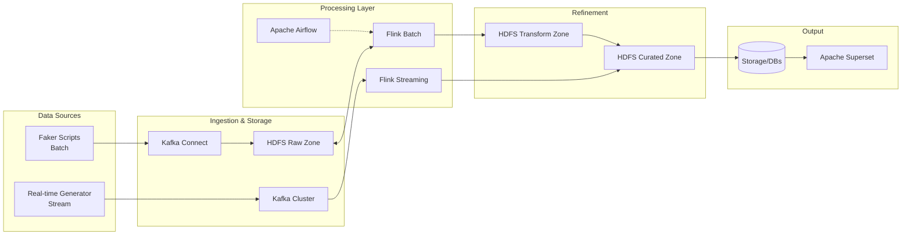

```mermaid
graph LR
    subgraph "Data Sources"
        S1[Faker Scripts<br/>Batch]
        S2[Real-time Generator<br/>Stream]
    end

    subgraph "Ingestion & Storage"
        KC[Kafka Connect]
        KQ[Kafka Cluster]
        RAW[HDFS Raw Zone]
    end

    subgraph "Processing Layer"
        FB[Flink Batch]
        FS[Flink Streaming]
        AF[Apache Airflow]
    end

    subgraph "Refinement"
        TR[HDFS Transform Zone]
        CU[HDFS Curated Zone]
    end

    subgraph "Output"
        DB[(Storage/DBs)]
        DASH[Apache Superset]
    end

    %% Flows
    S1 --> KC --> RAW
    S2 --> KQ --> FS
    RAW <--> FB
    AF -.-> FB
    FB --> TR --> CU
    FS --> CU
    CU --> DB --> DASH
```
